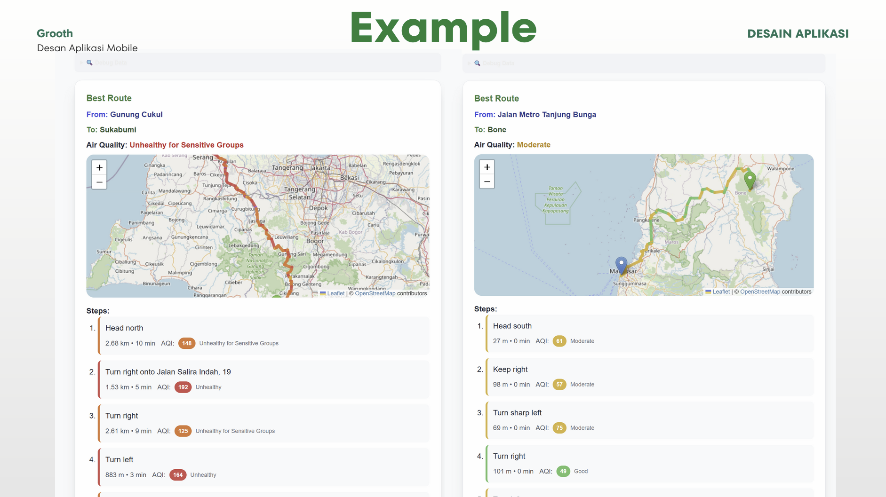

# 🌱 Grooth - Smart Air Quality Route Planner
### Screenshots



[](https://opensource.org/licenses/MIT)
[](https://nodejs.org/)
[](https://nextjs.org/)
[](https://www.docker.com/)
[](https://cloud.google.com/)

## 📋 Table of Contents

- [Overview](#overview)
- [Features](#features)
- [Demo](#demo)
- [Architecture](#architecture)
- [Quick Start](#quick-start)
- [Local Development](#local-development)
- [Cloud Deployment](#cloud-deployment)
- [API Documentation](#api-documentation)
- [Configuration](#configuration)
- [Contributing](#contributing)
- [License](#license)

## 🌟 Overview

**Grooth** is an intelligent route planning application that helps cyclists and commuters find the healthiest routes by analyzing real-time air quality data. Unlike traditional navigation apps that only consider distance and time, Grooth prioritizes your health by recommending routes with better air quality while still being practical for your journey.

### What Makes Grooth Special?

- 🌬️ **Real-time Air Quality Analysis**: Integrates with WAQI (World Air Quality Index) to get current pollution levels
- 🚴 **Smart Route Alternatives**: Generates multiple route options using different cycling profiles (regular cycling, road cycling, driving alternatives)
- 🗺️ **Interactive Visualization**: Beautiful maps showing route paths with air quality indicators
- 🔄 **Circular Route Support**: Perfect for fitness enthusiasts wanting round-trip routes with customizable duration and distance
- 📱 **Responsive Design**: Works seamlessly on desktop and mobile devices
- ☁️ **Cloud-Ready**: Fully containerized and deployable to Google Cloud Platform

## ✨ Features

### Core Functionality
- **Multi-Profile Routing**: Generate routes using cycling-regular, cycling-road, and driving-car profiles
- **Air Quality Integration**: Real-time AQI data for each route segment
- **Route Comparison**: Side-by-side comparison of "Good", "Alternative", and "Bad" routes
- **Interactive Maps**: Powered by Leaflet with custom markers and route visualization
- **Geolocation Support**: Auto-detect current location for easy route planning

### Advanced Features
- **Circular Routes**: Round-trip route generation with customizable parameters
- **Route Type Pagination**: Easy navigation between different route options
- **Step-by-Step Directions**: Detailed turn-by-turn navigation with AQI for each segment
- **Responsive UI**: Beautiful, mobile-friendly interface built with Tailwind CSS
- **Real-time Updates**: Dynamic route recalculation based on current conditions

### Technical Features
- **Microservices Architecture**: Separate frontend and backend services
- **Docker Containerization**: Easy deployment and scaling
- **Google Cloud Integration**: Cloud Run deployment with Secret Manager
- **API-First Design**: RESTful APIs for easy integration
- **TypeScript Support**: Type-safe development with full TypeScript coverage

## 🎯 Demo


**Main Interface Features:**
- Clean, intuitive interface for entering origin and destination
- Current location detection with one-click usage
- Circular route toggle for round-trip planning
- Route comparison with three different options (Good, Alternative, Bad)
- Interactive maps with AQI-colored route segments
- Step-by-step directions with air quality data for each segment

**Key Demo Highlights:**
- **Smart Route Comparison**: Three distinct route options with different air quality profiles
- **Real-time AQI Data**: Each route segment shows current air quality levels with color coding
- **Interactive Visualization**: Click on any route segment to see detailed AQI information
- **Comprehensive Route Details**: Distance, duration, and pollution metrics for informed decision-making

## 🏗️ Architecture

```
┌─────────────────┐    ┌─────────────────┐    ┌─────────────────┐
│   Frontend      │    │    Backend      │    │  External APIs  │
│   (Next.js)     │◄──►│   (Express.js)  │◄──►│                 │
│                 │    │                 │    │ • OpenRoute     │
│ • React 19      │    │ • Route Service │    │ • WAQI API      │
│ • TypeScript    │    │ • AQI Service   │    │ • Geocoding     │
│ • Tailwind CSS  │    │ • Utils         │    │                 │
│ • Leaflet Maps  │    │ • Controllers   │    │                 │
└─────────────────┘    └─────────────────┘    └─────────────────┘
        │                       │
        │                       │
        ▼                       ▼
┌─────────────────┐    ┌─────────────────┐
│   Docker        │    │   Docker        │
│   Container     │    │   Container     │
└─────────────────┘    └─────────────────┘
        │                       │
        │                       │
        ▼                       ▼
┌─────────────────────────────────────────┐
│         Google Cloud Platform          │
│                                         │
│ • Cloud Run (Frontend & Backend)       │
│ • Container Registry                    │
│ • Secret Manager (API Keys)            │
│ • Cloud Build (CI/CD)                  │
└─────────────────────────────────────────┘
```

### Project Structure

```
grooth/
├── 📁 frontend/                 # Next.js React application
│   ├── 📁 src/app/             # App router pages and components
│   ├── 📁 public/              # Static assets
│   ├── 📁 nginx/               # Nginx configuration
│   ├── 🐳 Dockerfile           # Frontend container
│   └── 📄 package.json         # Frontend dependencies
├── 📁 backend/                  # Express.js API server
│   ├── 📁 controllers/         # Business logic
│   ├── 📁 service/             # External API integrations
│   ├── 📁 utils/               # Helper functions
│   ├── 📁 routes/              # API route definitions
│   ├── 🐳 Dockerfile           # Backend container
│   └── 📄 package.json         # Backend dependencies
├── ☁️ cloudbuild.yaml          # Google Cloud Build configuration
├── 📄 README.md                # This file
└── 📄 .gitignore               # Git ignore rules
```

## 🚀 Quick Start

### Prerequisites

- **Node.js** 18+ 
- **npm** or **yarn**
- **Docker** (optional, for containerized deployment)
- **Google Cloud CLI** (for cloud deployment)

### API Keys Required

1. **OpenRoute Service API Key** - Get from [OpenRoute Service](https://openrouteservice.org/)
2. **WAQI API Key** - Get from [World Air Quality Index](https://aqicn.org/api/)

### 1-Minute Setup

```bash
# Clone the repository
git clone https://github.com/aliefauzan/hekaton.git
cd hekaton

# Setup backend
cd backend
npm install
cp .env.example .env
# Edit .env and add your API keys
npm start

# Setup frontend (in new terminal)
cd ../frontend
npm install
npm run dev
```

Visit `http://localhost:3000` and start planning healthier routes! 🎉

## 💻 Local Development

### Backend Setup

1. **Navigate to backend directory**
   ```bash
   cd backend
   ```

2. **Install dependencies**
   ```bash
   npm install
   ```

3. **Configure environment variables**
   ```bash
   cp .env.example .env
   ```
   
   Edit `.env` file:
   ```env
   PORT=5000
   OPEN_ROUTE_API_KEY=your_openroute_api_key
   WAQI_API_KEY=your_waqi_api_key
   ```

4. **Start the backend server**
   ```bash
   npm start
   # Backend will run on http://localhost:5000
   ```

### Frontend Setup

1. **Navigate to frontend directory**
   ```bash
   cd frontend
   ```

2. **Install dependencies**
   ```bash
   npm install
   ```

3. **Configure API endpoint** (optional)
   ```bash
   # Create .env.local if needed
   echo "NEXT_PUBLIC_API_URL=http://localhost:5000" > .env.local
   ```

4. **Start the development server**
   ```bash
   npm run dev
   # Frontend will run on http://localhost:3000
   ```

### Docker Development

For a complete containerized setup:

```bash
# Build and run backend
cd backend
docker build -t grooth-backend .
docker run -p 5000:5000 --env-file .env grooth-backend

# Build and run frontend
cd ../frontend
docker build -t grooth-frontend .
docker run -p 3000:3000 grooth-frontend
```

### Development Workflow

1. **Backend Development**
   - API endpoints in `backend/routes/`
   - Business logic in `backend/controllers/`
   - External services in `backend/service/`
   - Utilities in `backend/utils/`

2. **Frontend Development**
   - Main app in `frontend/src/app/page.tsx`
   - Components in `frontend/src/components/`
   - Styles using Tailwind CSS
   - Maps with React Leaflet

3. **Testing**
   ```bash
   # Test backend API
   curl "http://localhost:5000/api/route?from=-6.2001,106.8166&to=-6.1745,106.8227"
   
   # Test frontend
   # Visit http://localhost:3000 and use the interface
   ```

## ☁️ Cloud Deployment

### Google Cloud Platform Setup

#### Prerequisites

1. **Google Cloud Account** with billing enabled
2. **Google Cloud CLI** installed and configured
3. **Required APIs enabled**:
   - Cloud Run API
   - Cloud Build API
   - Container Registry API
   - Secret Manager API

#### Setup Instructions

1. **Authenticate and set project**
   ```bash
   gcloud auth login
   gcloud config set project YOUR_PROJECT_ID
   ```

2. **Enable required APIs**
   ```bash
   gcloud services enable run.googleapis.com
   gcloud services enable cloudbuild.googleapis.com
   gcloud services enable containerregistry.googleapis.com
   gcloud services enable secretmanager.googleapis.com
   ```

3. **Create secrets in Secret Manager**
   ```bash
   # Create OpenRoute API key secret
   gcloud secrets create OPEN_ROUTE_API_KEY --replication-policy="automatic"
   echo -n "YOUR_OPENROUTE_KEY" | gcloud secrets versions add OPEN_ROUTE_API_KEY --data-file=-

   # Create WAQI API key secret
   gcloud secrets create WAQI_API_KEY --replication-policy="automatic"
   echo -n "YOUR_WAQI_KEY" | gcloud secrets versions add WAQI_API_KEY --data-file=-

   # Create combined API keys secret (for backward compatibility)
   echo "OPEN_ROUTE_API_KEY=YOUR_OPENROUTE_KEY
   WAQI_API_KEY=YOUR_WAQI_KEY" | gcloud secrets create api --data-file=-
   ```

4. **Configure Cloud Build permissions**
   ```bash
   # Get Cloud Build service account
   PROJECT_NUMBER=$(gcloud projects describe YOUR_PROJECT_ID --format="value(projectNumber)")
   
   # Grant Secret Manager access
   gcloud projects add-iam-policy-binding YOUR_PROJECT_ID \
     --member="serviceAccount:${PROJECT_NUMBER}@cloudbuild.gserviceaccount.com" \
     --role="roles/secretmanager.secretAccessor"
   
   # Grant Cloud Run admin access
   gcloud projects add-iam-policy-binding YOUR_PROJECT_ID \
     --member="serviceAccount:${PROJECT_NUMBER}@cloudbuild.gserviceaccount.com" \
     --role="roles/run.admin"
   ```

5. **Update cloudbuild.yaml**
   ```yaml
   # Update the substitutions in cloudbuild.yaml
   substitutions:
     _PROJECT_ID: "YOUR_PROJECT_ID"
     _REGION: "YOUR_PREFERRED_REGION"  # e.g., us-central1, asia-southeast2
   ```

6. **Deploy using Cloud Build**
   ```bash
   gcloud builds submit --config cloudbuild.yaml .
   ```

#### Deployment Process

The Cloud Build process will:

1. **Build Docker images** for both frontend and backend
2. **Push images** to Google Container Registry
3. **Deploy backend** to Cloud Run with secrets from Secret Manager
4. **Deploy frontend** to Cloud Run with backend URL configured
5. **Configure networking** and permissions

#### Post-Deployment

After successful deployment:

1. **Get service URLs**
   ```bash
   # Backend URL
   gcloud run services describe grooth-backend --region=YOUR_REGION --format="value(status.url)"
   
   # Frontend URL  
   gcloud run services describe grooth-frontend --region=YOUR_REGION --format="value(status.url)"
   ```

2. **Test the deployment**
   ```bash
   # Test backend API
   curl "BACKEND_URL/api/route?from=-6.2001,106.8166&to=-6.1745,106.8227"
   
   # Visit frontend URL in browser
   ```

3. **Set up custom domain** (optional)
   ```bash
   gcloud run domain-mappings create --service grooth-frontend --domain your-domain.com --region YOUR_REGION
   ```

### Alternative Deployment Options

#### Vercel (Frontend Only)
```bash
cd frontend
npm install -g vercel
vercel --prod
```

#### Heroku
```bash
# Backend
heroku create grooth-backend
heroku config:set OPEN_ROUTE_API_KEY=your_key WAQI_API_KEY=your_key
git subtree push --prefix backend heroku main

# Frontend
heroku create grooth-frontend
heroku config:set NEXT_PUBLIC_API_URL=https://grooth-backend.herokuapp.com
git subtree push --prefix frontend heroku main
```

#### Docker Compose (Self-hosted)
```yaml
# docker-compose.yml
version: '3.8'
services:
  backend:
    build: ./backend
    ports:
      - "5000:5000"
    environment:
      - OPEN_ROUTE_API_KEY=${OPEN_ROUTE_API_KEY}
      - WAQI_API_KEY=${WAQI_API_KEY}
  
  frontend:
    build: ./frontend
    ports:
      - "3000:3000"
    environment:
      - NEXT_PUBLIC_API_URL=http://localhost:5000
    depends_on:
      - backend
```

## 📚 API Documentation

### Base URL
- **Local**: `http://localhost:5000`
- **Production**: `https://grooth-backend-[hash]-[region].a.run.app`

### Endpoints

#### Get Route Recommendations

**Regular Routes**
```http
GET /api/route?from={origin}&to={destination}
```

**Circular Routes**
```http
GET /api/route?from={location}&to={location}&type=circular&duration={minutes}&distance={km}&routeType={type}
```

#### Parameters

| Parameter | Type | Required | Description |
|-----------|------|----------|-------------|
| `from` | string | Yes | Origin point (lat,lng or address) |
| `to` | string | Yes | Destination point (lat,lng or address) |
| `type` | string | No | Set to "circular" for round trips |
| `duration` | number | No | Circular route duration in minutes |
| `distance` | number | No | Circular route distance in km |
| `routeType` | string | No | balanced, scenic, fitness, duration, distance |

#### Response Format

```json
{
  "best": {
    "from": "Origin Address",
    "to": "Destination Address", 
    "steps": [
      {
        "instruction": "Turn left onto Main St",
        "distance": "0.2 km",
        "duration": "2 mins",
        "start_location": {"lat": -6.2001, "lng": 106.8166},
        "end_location": {"lat": -6.2010, "lng": 106.8170},
        "aqi": 45
      }
    ],
    "pollutionScore": "Good",
    "avgAQI": 48.5,
    "recommended": true
  },
  "alternative": { /* similar structure */ },
  "worst": { /* similar structure */ },
  "isCircular": false
}
```

#### Example Requests

**Basic Route**
```bash
curl "http://localhost:5000/api/route?from=-6.2001,106.8166&to=-6.1745,106.8227"
```

**Circular Route**
```bash
curl "http://localhost:5000/api/route?from=-6.2001,106.8166&to=-6.2001,106.8166&type=circular&duration=30&routeType=scenic"
```

**Address-based Route**
```bash
curl "http://localhost:5000/api/route?from=Jakarta%20Central&to=Bogor%20City"
```

### Error Handling

```json
{
  "error": "Error message",
  "details": "Additional error details",
  "status": 400
}
```

Common error codes:
- `400`: Bad Request (invalid parameters)
- `500`: Internal Server Error
- `503`: External API unavailable

## ⚙️ Configuration

### Environment Variables

#### Backend (.env)
```env
# Required
OPEN_ROUTE_API_KEY=your_openroute_service_api_key
WAQI_API_KEY=your_world_air_quality_index_api_key

# Optional
PORT=5000
NODE_ENV=development
```

#### Frontend (.env.local)
```env
# Optional - defaults to relative paths in production
NEXT_PUBLIC_API_URL=http://localhost:5000
```

### API Key Setup

#### OpenRoute Service
1. Visit [OpenRoute Service](https://openrouteservice.org/)
2. Create free account
3. Generate API key
4. Enable routing services

#### WAQI (World Air Quality Index)
1. Visit [WAQI API](https://aqicn.org/api/)
2. Request API token
3. Verify email and activate
4. Use token for air quality data

### Customization Options

#### Route Types
Modify `backend/service/routeService.js`:
```javascript
const profiles = [
  'cycling-regular',  // Standard cycling
  'cycling-road',     // Road cycling optimized
  'driving-car',      // Car alternative
  'foot-walking'      // Walking option
];
```

#### UI Theming
Customize colors in `frontend/src/app/page.tsx`:
```javascript
const routeColors = {
  best: 'green',      // Good routes
  alternative: 'orange', // Alternative routes  
  worst: 'red'        // Poor air quality routes
};
```

#### Map Configuration
Adjust map settings in `frontend/src/app/LeafletMap.tsx`:
```javascript
const mapConfig = {
  center: [-6.2088, 106.8456], // Jakarta default
  zoom: 13,
  maxZoom: 18
};
```

## 🤝 Contributing

We welcome contributions! Please follow these guidelines:

### Getting Started

1. **Fork the repository**
2. **Create a feature branch**
   ```bash
   git checkout -b feature/amazing-feature
   ```
3. **Make your changes**
4. **Test thoroughly**
5. **Submit a pull request**

### Development Guidelines

#### Code Style
- **Backend**: Follow Node.js best practices
- **Frontend**: Use TypeScript and React hooks
- **Styling**: Tailwind CSS utility classes
- **Formatting**: Prettier configuration included

#### Commit Convention
```
feat: add new route algorithm
fix: resolve air quality API timeout
docs: update deployment guide
style: improve mobile responsiveness
```

#### Testing
```bash
# Backend tests
cd backend && npm test

# Frontend tests  
cd frontend && npm test

# Integration tests
npm run test:integration
```

### Issue Reporting

When reporting issues, please include:
- **Environment details** (OS, Node.js version, browser)
- **Steps to reproduce**
- **Expected vs actual behavior**
- **Screenshots** (for UI issues)
- **Error logs** (if applicable)

### Feature Requests

For new features, please:
1. **Check existing issues** first
2. **Describe the use case** clearly
3. **Provide implementation ideas** if possible
4. **Consider backward compatibility**

## 📝 License

This project is licensed under the MIT License - see the [LICENSE](LICENSE) file for details.

```
MIT License

Copyright (c) 2024 Grooth Team

Permission is hereby granted, free of charge, to any person obtaining a copy
of this software and associated documentation files (the "Software"), to deal
in the Software without restriction, including without limitation the rights
to use, copy, modify, merge, publish, distribute, sublicense, and/or sell
copies of the Software, and to permit persons to whom the Software is
furnished to do so, subject to the following conditions:

The above copyright notice and this permission notice shall be included in all
copies or substantial portions of the Software.

THE SOFTWARE IS PROVIDED "AS IS", WITHOUT WARRANTY OF ANY KIND, EXPRESS OR
IMPLIED, INCLUDING BUT NOT LIMITED TO THE WARRANTIES OF MERCHANTABILITY,
FITNESS FOR A PARTICULAR PURPOSE AND NONINFRINGEMENT. IN NO EVENT SHALL THE
AUTHORS OR COPYRIGHT HOLDERS BE LIABLE FOR ANY CLAIM, DAMAGES OR OTHER
LIABILITY, WHETHER IN AN ACTION OF CONTRACT, TORT OR OTHERWISE, ARISING FROM,
OUT OF OR IN CONNECTION WITH THE SOFTWARE OR THE USE OR OTHER DEALINGS IN THE
SOFTWARE.
```

---

## 🙏 Acknowledgments

- **OpenRoute Service** for providing excellent routing APIs
- **World Air Quality Index** for real-time pollution data
- **Leaflet** for beautiful interactive maps
- **Next.js & React** for the amazing frontend framework
- **Express.js** for the robust backend framework
- **Google Cloud Platform** for reliable cloud infrastructure
- **Tailwind CSS** for the utility-first styling approach

---

## 🔗 Links

- **Live Demo**: *(Not For Public)*
- **Documentation**: [API Docs](./docs/api.md)
- **Issues**: [GitHub Issues](https://github.com/aliefauzan/hekaton/issues)
- **Discussions**: [GitHub Discussions](https://github.com/aliefauzan/hekaton/discussions)

---

**Made with ❤️ for healthier commuting**

*Start planning your next healthy journey with Grooth!* 🌱🚴‍♂️